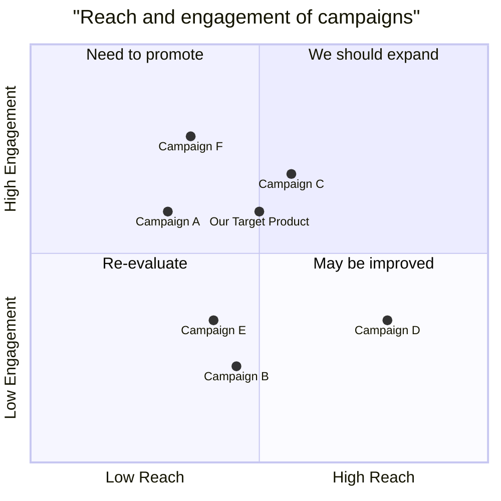

## Language

en_us

## Programming Language

Rust

## Original Requirements

Create a GUI tic-tac-toe smart contract for solana platform in Rust language

## Project Name

tic_tac_toe

## Product Goals

- Create a user-friendly interface
- Ensure secure and transparent gameplay
- Enable seamless interaction with the Solana blockchain

## User Stories

- As a player, I want to be able to easily connect my Solana wallet to the game
- As a player, I want to be able to see the current state of the game board
- As a player, I want to be able to make moves on the game board
- As a player, I want to be able to see the outcome of the game (win, lose, or draw)
- As a player, I want to be able to play against other players online

## Competitive Analysis

- Tic-Tac-Toe on Ethereum: Limited user base, complex smart contract
- Tic-Tac-Toe on Polygon: Good user experience, but high transaction fees
- Tic-Tac-Toe on Avalanche: Fast and scalable, but limited smart contract functionality

## Competitive Quadrant Chart

## Requirement Analysis

The project requires a strong understanding of Rust programming language, smart contract development, and blockchain technology. Additionally, experience with game development and user interface design would be beneficial.

## Requirement Pool

- ['P0', 'Develop a user-friendly GUI for the game']
- ['P0', 'Create a secure and transparent smart contract for the game logic']
- ['P0', 'Integrate the game with the Solana blockchain']
- ['P1', 'Implement multiplayer functionality for the game']
- ['P2', 'Add additional features such as leaderboards and achievements']

## UI Design draft

The GUI should be simple and easy to use, with a clear and concise layout. The game board should be prominently displayed, with the player's moves and the current state of the game clearly visible. The user interface should also include buttons for connecting to the Solana wallet, making moves, and viewing the outcome of the game.

## Anything UNCLEAR

The specific details of the smart contract logic and the multiplayer functionality are not entirely clear. Further clarification from the client would be helpful.

