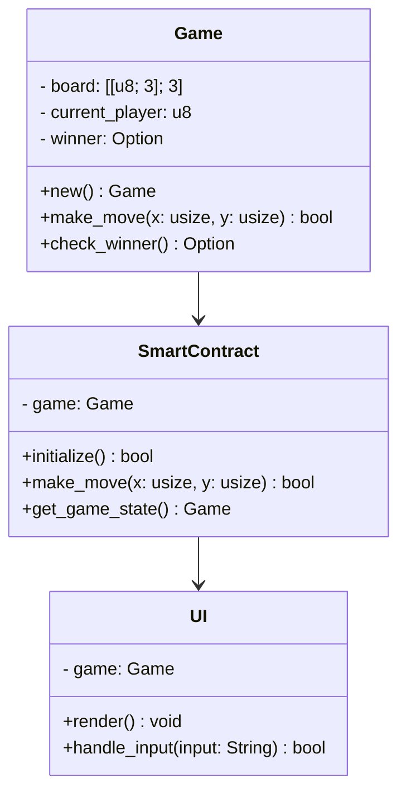
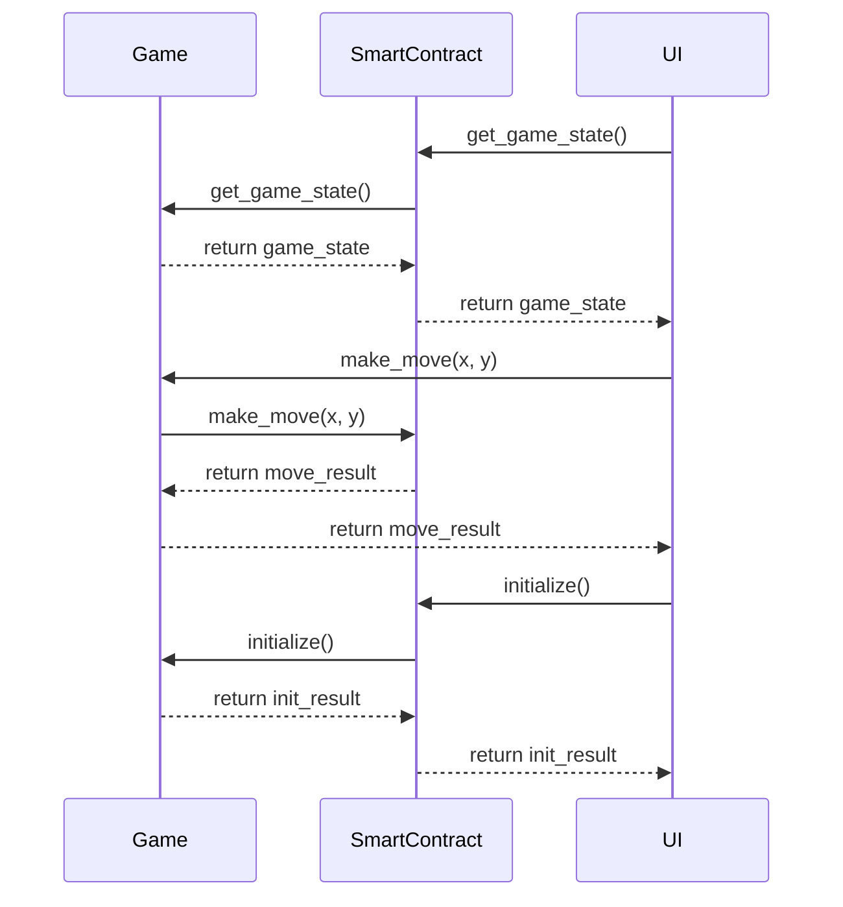

## Implementation approach

We will use the Rust programming language and the Solana platform to create a secure and transparent tic-tac-toe smart contract. The game's user interface will be built using the Rust programming language and the Iced library, which provides a simple and easy-to-use API for creating graphical user interfaces. The smart contract will be deployed to the Solana blockchain using the Anchor framework, which provides a high-level API for creating and interacting with smart contracts.

## File list

- main.rs
- game.rs
- smart_contract.rs
- ui.rs

## Data structures and interfaces

## Program call flow

## Anything UNCLEAR

Clarification needed on the specific rules of the tic-tac-toe game, such as whether draws are allowed and how ties are handled.

