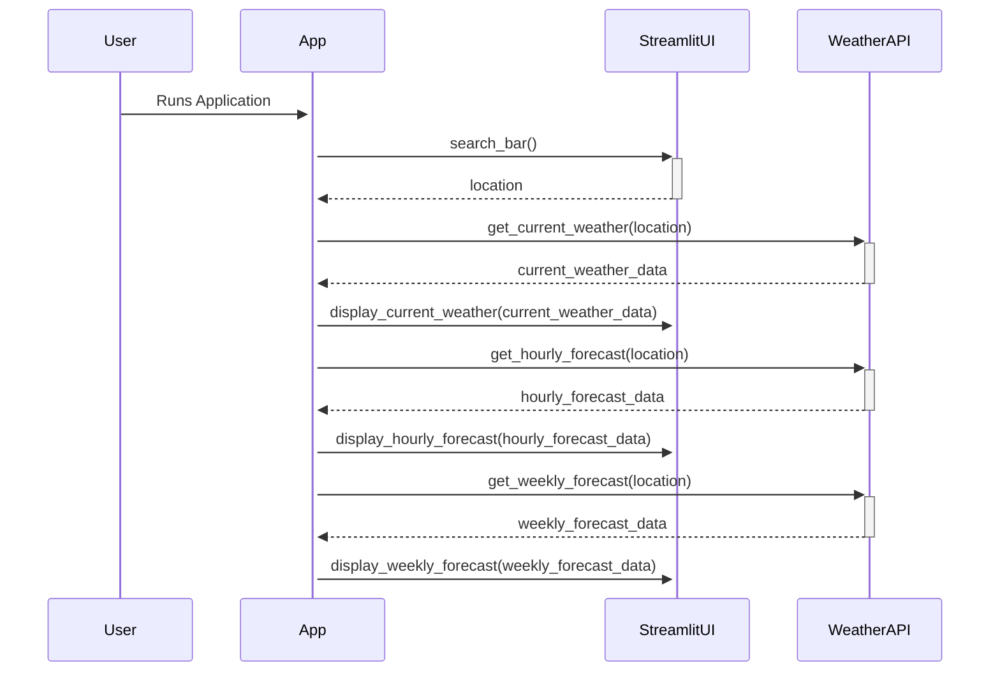

## Code Review All

Upon reviewing the provided code for the weather forecast application, several observations and potential issues were identified:

1. **Redundancy in `WeatherAPI` Class Across Files**: The `WeatherAPI` class is defined in both `weather_api.py` and `app.py`, which is redundant. Ideally, `app.py` should import the `WeatherAPI` class from `weather_api.py` to avoid code duplication and maintain consistency.

2. **Inconsistent Error Handling**: The error handling in `weather_api.py`'s `_get_response` method prints errors to the console, while `app.py` uses Streamlit's `st.error` for user-facing error messages. It's important to have a consistent approach to error handling across the application.

3. **Pandas Dependency**: The `weather_api.py` file uses Pandas for processing weekly forecast data, but the requirement specified not needing additional package installations beyond Streamlit and requests. This violates the given constraints.

4. **API Key Management**: The API key is hardcoded in `app.py`, which is not a secure practice. It would be better to use environment variables or a configuration file to manage sensitive information like API keys.

5. **Lack of Input Validation**: The application does not validate user input from the search bar. Malformed or unexpected input could lead to API request failures or errors.

6. **StreamlitUI Class Methods Lack Data Validation**: The methods in the `StreamlitUI` class do not validate the structure or presence of keys in the data dictionaries they receive. This could lead to KeyError exceptions if the data is not as expected.

7. **Unimplemented Features**: The system design mentions displaying current, hourly, and weekly forecasts, but the implementation of displaying detailed weather conditions (like humidity, pressure, etc.) in the UI is missing.

## Call flow



## Summary

The application is designed to fetch and display weather data using the OpenWeatherMap API, structured around a `WeatherAPI` class for handling API requests and a `StreamlitUI` class for the user interface. The application allows users to search for a location and view current, hourly, and weekly weather forecasts. However, there are issues with code redundancy, error handling, unnecessary dependency on Pandas, API key management, lack of input validation, and incomplete implementation of the UI for detailed weather conditions.

## TODOs

```python
{
    "weather_api.py": "Remove Pandas dependency for processing weekly forecast data to adhere to the requirement of not needing additional package installations.",
    "app.py": "Refactor to import and use the WeatherAPI class from weather_api.py to eliminate redundancy. Implement secure API key management using environment variables. Add input validation for user inputs and data validation in StreamlitUI class methods.",
    "general": "Implement a consistent approach to error handling across the application. Consider adding more detailed weather information in the UI as per the initial design."
}
```